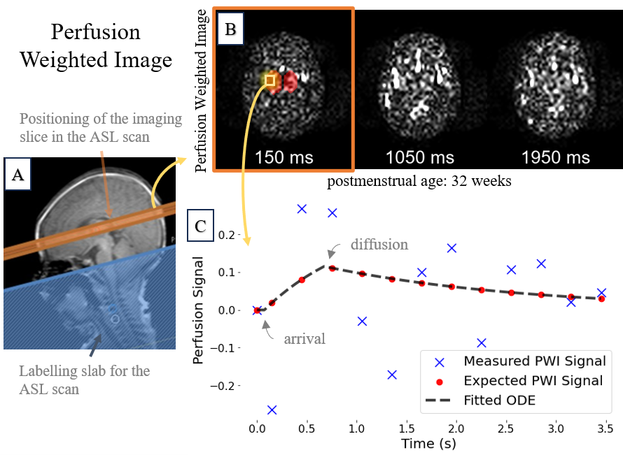
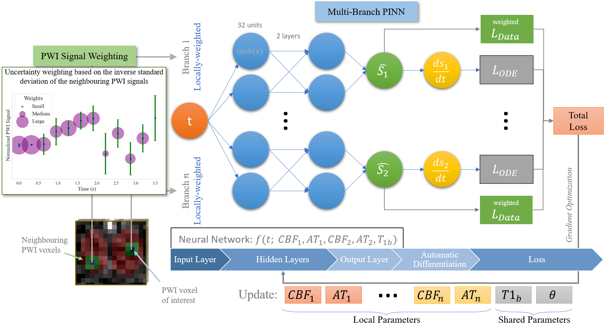

# PINNing Cerebral Blood Flow: Analysis of Perfusion MRI in Infants using Physics-Informed Neural Networks

## Abstract

This repository contains the source code, data, and supplementary materials for the research paper titled **"PINNing Cerebral Blood Flow: Analysis of Perfusion MRI in Infants using Physics-Informed Neural Networks"** by Christoforos Galazis, Ching-En Chiu, Tomoki Arichi, Anil A. Bharath and Marta Varela.

This project introduces SUPINN, a novel spatial uncertainty-based physics-informed neural network (PINN) (see Fig.2), designed to estimate cerebral blood flow (CBF) and other parameters from noisy arterial spin labeling (ASL) MRI data in infants (see Fig.1). By incorporating spatial uncertainties, SUPINN outperforms traditional methods in estimating CBF, bolus arrival time, and blood relaxation time, providing physiologically plausible and spatially smooth results. This framework has the potential to improve our understanding of infant cardio-brain networks, aiding in the detection and management of neurological issues in this vulnerable population.

|  | 
|:--:|
| _<span id="Fig1">Fig. 1</span>_ A representative 32-week postmenstrual case showing: A) $T_2$-weighted image highlighting the ASL imaging slice (orange); B) Subsampled perfusion-weighted image time series; and C) The measured perfusion signal of a single voxel over the entire duration, along with the corresponding ground-truth analytical model. |

|  | 
|:--:|
| _<span id="Fig2">Fig. 2</span>_ Overview of our proposed SUPINN model, depicted here in a 2-branch variant for illustration purposes, but adaptable to larger configurations. This study employs a 3-branch model based on empirical findings. |


## Repository Structure

```plaintext
.
├── data_mat/                 # The expected location of the dataset (research data is not currently available)
├── src/                      # Source code for the models and experiments
│   ├── data/                 # Code related to data loading and processing
│   ├── model/                # Code related to PINN model
│   └── run_training.py       # The main execution file
├── figures/                  # Figures used in the paper
├── README.md                 # This README file
└── environment.yml           # Required packages and dependencies
```

## Installation

### Requirements

Ensure you have Anaconda or Miniconda installed.

### Setup

1. Clone the repository:
   ```bash
   git clone https://github.com/cgalaz01/supinn.git
   cd supinn
   ```
 
2. Create a new conda environment and isntall packages:
   ```bash
   conda env create -f environment.yml
   ```
   
3. Activate new environment:
   ```bash
   conda activate supinn
   ```
   
## Usage

Run the PINN training script using the following command:
   ```bash
   python run_training.py [options]
   ```
   
To see available options run:
   ```bash
   python run_training.py --help
   ```
   
The default arguments are used to setup the proposed SUPINN model.

## License

This project is licensed under the MIT License - see the LICENSE file for details.

## Contact

Feel free to open an issue or submit a pull request if you find any issues or have suggestions for improvements.